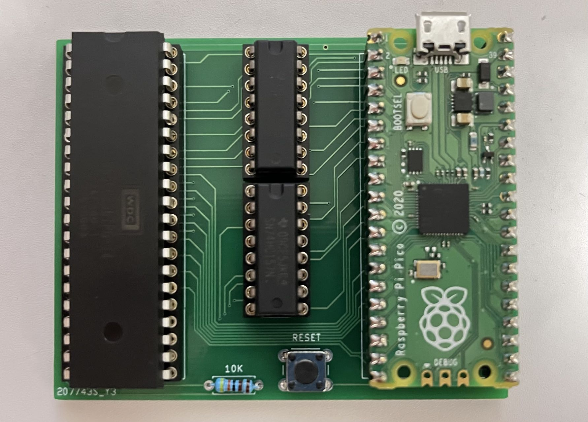

## APPLE1_PICO
An apple 1 replica with a raspberry pi serving as the RAM, ROM and PIA.  

### Board
Please refer to [Apple1-pico_pcb](https://github.com/chemwolf6922/Apple1-pico_pcb)  
#### BOM
* 1 x MOS 65C02 CPU
* 1 x Raspberry pi pico
* 1 x push button (reset button)
* 1 x resister
* 2 x 74HC157 (For address read paging)
### Software
The workload was seperated onto two cores for better clock consistency. 
* Core 0 runs IO (USB CDC terminal)
* Core 1 runs RAM, ROM, PIA logic. 

By default, the 65C02 runs at 1~1.2MHz.
#### Other 6502 computers
This board should be able to replicate other 6502 systems with a pico firmware udpate. The NMI and IRQ lines not used in APPLE1 are connected to the pico for more possibilities.
